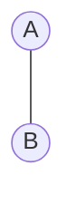
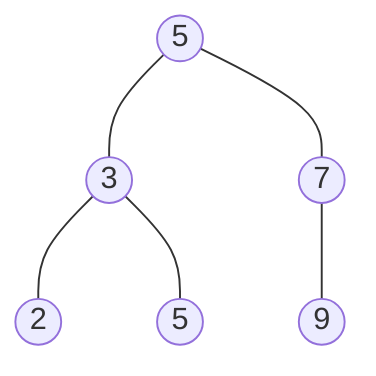

A binary tree is a linked data strucutres in which each node is an object
Each node contains the attriubutes, 
- Key field 
- Satellite data
- Left: Pointer to left child
- RIght: pointer to right child
- p: pointer to parent
All of these should satisfy the binary search tree property
Okay, so what is the binary search tree property? Let $x$ be a node in a binary search tree
		1. if y is in the left subtree of $x$ , then the $key[y] \leq key[x]$  
		2. if y is in the right subtree of $x$, then $key[y] \geq key[x]$ 
Binary Search Trees support many dynamic set operations that can include 
	- Search
	- Minimum
	- Maximum
	- Predecessor
	- Successor
	- Insert
	- Delete
	The running time of basic operations on BST on average are $\theta(lg n)$ 
		Expected height of the tree is $lg  n$
	In the worst case $\theta(n)$
		The tree is unbalanced and is a linear chain of nodes( This is essentially a linked list)

## Traversing a BST
So how do we traverse a binary tree? 
1. In order tree walk: The idea here is to print the root between the values of its left and right subtrees: left, root, right. The keys are then printed in a sorted order. The Running time of this is about $\theta(n)$, where n is the size of the tree rooted at x. using the tree above 2,3,5,5,7,9
2. Preorder tree walk: the root is printed first: root, left, right. Using the Tree above 5,3,2,5,7,9
3. Post order tree walk: root is printed last: left, right, root: Using the tree above 2,5,3,9,7,5
### Querying a BST 
so how do we query for a value in a Binary Tree?
- Input:
	-  